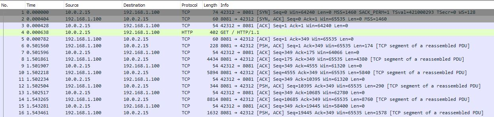

# Security Footage write-up

## Description

Link to the challenge: [Security Footage](https://tryhackme.com/room/securityfootage)
*Someone broke into our office last night, but they destroyed the hard drives with the security footage. Can you recover the footage?*

## Solution

This challenge is a simple TCP rassembling challenge. The flag is hidden in the TCP stream, and we need to extract it.

### Analysis

First thing we see in the pcap capture is a GET request followed by a lot of TCP packets.



Following the TCP stream, we can see that the content type is `image/jpeg`.

### Extracting the TCP stream

We can use `Wireshark` to extract the TCP stream. We can do this by right-clicking on the TCP stream and selecting `Follow -> TCP Stream`.
This will open a new window with the TCP stream. We can then save the stream as a file by clicking on `File -> Export As...` and selecting `Raw`. We can save the file as `stream.txt`. Or we could do it using python...

```python
from scapy.all import rdpcap, TCP

pcap_file = "security-footage-1648933966395.pcap"
packets = rdpcap(pcap_file) # Read the pcap file

# JPEG files start with 0xFFD8 and end with 0xFFD9 (magic numbers)
jpeg_start = b'\xff\xd8' # Start of JPEG file 
jpeg_end = b'\xff\xd9' # End of JPEG file

# Extract all TCP payloads
payloads = []
for pkt in packets: # Iterate through all packets
    if pkt.haslayer(TCP): # Check if the packet has a TCP layer
        raw = bytes(pkt[TCP].payload) # Extract the raw TCP payload
        if raw: # Check if the payload is not empty
            payloads.append(raw) # Append the payload to the list

# Join all TCP payloads into a single binary stream
data = b''.join(payloads)

# Find and extract JPEG images
i = 0
pos = 0
while True: # Loop until no more JPEG images are found
    start = data.find(jpeg_start, pos) # Find the start of the JPEG image
    if start == -1: # If no more start marker is found, break the loop
        break
    end = data.find(jpeg_end, start) # Find the end of the JPEG image
    if end == -1: # If no more end marker is found, break the loop
        break
    end += 2 
    with open(f"image_{i:04d}.jpg", "wb") as f: # Open a new file to write the image
        f.write(data[start:end]) # Write the image data to the file
    i += 1
    pos = end

print(f"{i} found image.")
```

This will extract all the JPEG images from the TCP stream and save them as `image_0000.jpg`, `image_0001.jpg`, etc.

